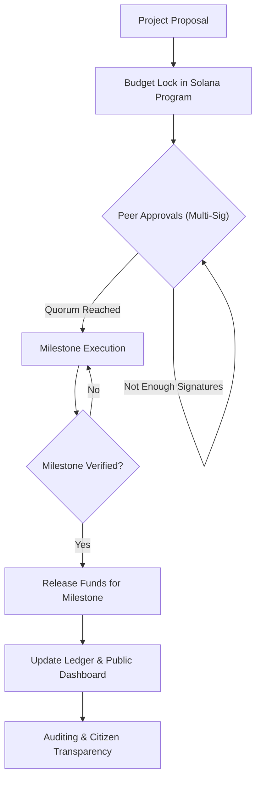
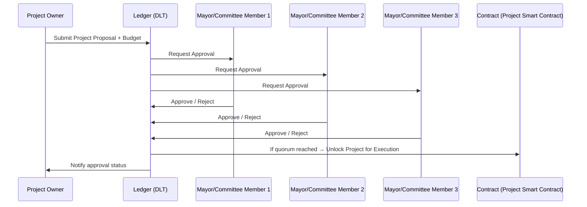

# "Traceable Funds": Transparent Project Proposals (using DLT) 

## Flowchart

Here’s a **short README** draft that just captures the flow in simple sentences:

---

## 📌 Idea

Projects are proposed and approved on a distributed ledger to ensure transparency, accountability, and prevent overspending.

## 🔄 Flow

1. **Proposal** → A project and its budget are submitted.
2. **Budget Lock** → Funds are locked to the approved amount.
3. **Peer Approval** → Multiple peers must sign before execution.
4. **Milestone Release** → Funds are released step by step as progress is verified.
5. **Traceability** → All actions are recorded on the ledger for public transparency.

### 1. The Proposal Stage: Creating a Secure Foundation

The **proposal stage** is the foundational step in your traceable funds system, setting the groundwork for all subsequent actions. It's the point where a project, along with its specific funding needs, is formally introduced into the system. This stage is crucial for establishing **transparency** and **accountability** from the very beginning.

The process is initiated by a project creator, who submits a detailed proposal. This isn't just a simple request for money; it's a comprehensive submission that outlines the project's purpose, its intended impact, and, most importantly, a granular budget. This proposal acts as the "master plan" that all future actions will be measured against.

Key components of the proposal stage include:

* **Project Description:** A clear explanation of what the project aims to achieve. This provides context for the reviewers and the public.
* **Detailed Budget:** A line-item breakdown of how the requested funds will be used. This is a critical element, as it's what the Solana program will eventually lock in. The budget should be itemized, potentially including categories like personnel, materials, and operational costs.
* **Milestone-based Plan:** The project should be broken down into distinct, verifiable **milestones**. Each milestone has a specific deliverable and an associated portion of the total budget. This is central to the system's "Milestone Release" step, as funds are only released incrementally upon verification of each milestone's completion.
* **Submission to the Ledger:** Once drafted, the proposal is submitted to the **distributed ledger**, making it immutable and publicly accessible. This action kicks off the formal review process and ensures that all stakeholders, from peers to the public, have access to the original project plan.

By ensuring a detailed, milestone-driven proposal is submitted and recorded on the ledger, the system prevents overspending and allows for real-time tracking of funds. This initial step is what makes the subsequent peer approvals and milestone releases possible, creating a secure and verifiable chain of custody for the funds. 

### 2. Budget Lock: Securing the Funds on the Blockchain

Once a project proposal is submitted and approved by the necessary peers, the system proceeds to the **Budget Lock** stage. This is a crucial step that moves the project from a theoretical plan to a financial reality. Using a **Solana program**, the exact amount of funds required for the entire project, as outlined in the proposal, is programmatically locked. This isn't just a simple earmarking of funds in a traditional database; it's a cryptographic lock on the blockchain itself. This action ensures the funds cannot be overspent, re-allocated, or used for any purpose other than what was specified in the original proposal. The total budget becomes an immutable parameter within the smart contract, providing a foundational layer of security and trust.

This process eliminates the risk of budget creep, where project costs gradually escalate beyond their initial estimates. By locking the total amount, the system enforces strict financial discipline from the outset. If a project requires more funding later, it would necessitate a completely new proposal and a new round of peer approvals. This prevents uncontrolled spending and holds project leaders accountable to their initial financial commitments. The locked funds are not released all at once; they remain secure in the smart contract's custody, waiting to be dispersed incrementally as milestones are met.

The budget lock also serves as a public declaration of the project's financial commitment. Because this transaction is recorded on the public ledger, anyone can verify that the necessary funds have been secured and dedicated to a specific project. This level of transparency builds trust with all stakeholders, including investors, taxpayers, and the general public. It's a key mechanism that transforms a simple request for funds into a fully auditable and transparent financial transaction, reinforcing the core principles of your traceable funds idea.

### 3. Peer Approval Process

### 4. Milestone Release: Incremental Funding for Verified Progress

The **Milestone Release** stage is the core mechanism that connects project progress to fund disbursement. Unlike traditional funding models that might release a large sum upfront, your system ensures that funds are only released step by step, as progress is verified. This process is triggered when a project milestone, as defined in the initial proposal, is completed. A designated verifier—or, more likely, a group of peer validators—inspects the work and confirms that the deliverable has been met. This verification is crucial; it prevents the release of funds for uncompleted or substandard work. Once the verification is approved, the smart contract is triggered to release a pre-determined portion of the locked funds—specifically the amount allocated to that particular milestone. This ensures that a project team has the necessary capital for the current phase without having access to the entire budget, which significantly reduces financial risk and encourages a focus on defined, short-term goals.

### 5. Traceability: The Public and Immutable Ledger

**Traceability** is the final and most critical outcome of the system, powered by the distributed ledger. Every single action—from the initial proposal submission to the final fund release—is recorded on the blockchain as a permanent, immutable transaction. This creates a comprehensive and publicly accessible audit trail that cannot be altered or deleted. Every peer signature, every fund release, and every milestone verification is time-stamped and logged, providing an unparalleled level of transparency. This ledger serves as the single source of truth for the project's financial history. Auditors can easily review the entire flow of funds, and citizens can use the public dashboard to track how their money is being spent in real-time. This perpetual record eliminates the potential for hidden transactions or misuse of funds, making true accountability and citizen oversight a reality.

